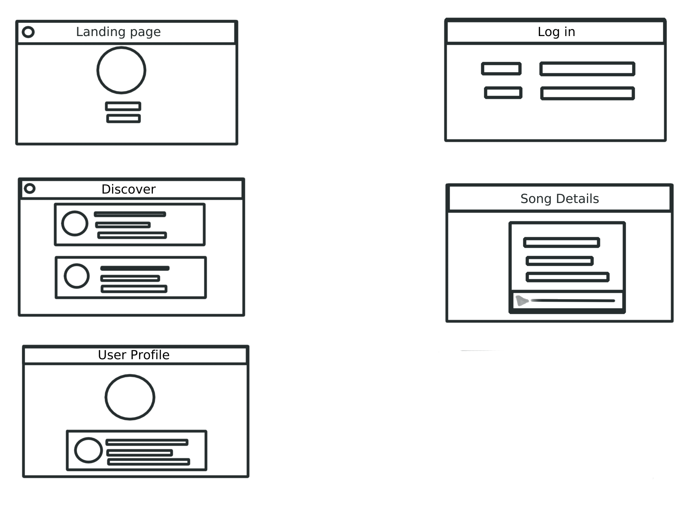
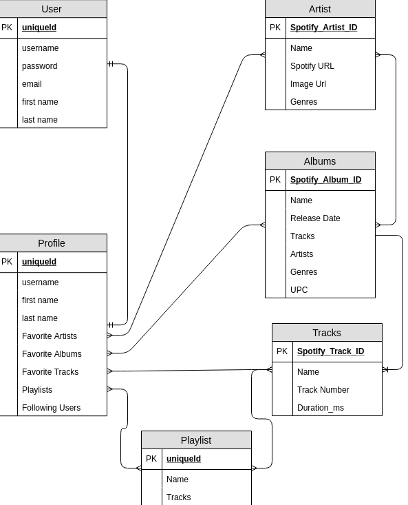

# PyTunes

### Objective
___
PyTunes is a app to discover new underground music and create playlists.

### User Stories
___
- AAU When I log in I would like to see my profile with my playlists
- AAU I want to be able to follow my friends and listen to their playlists.
- AAU I want to be able to link my spotify account.
- AAU I want to be able to upload my own music.
- AAU I want to be able to update edit and delete my playlists.

### Stretch Goals
___
- Allow signed in users to comment on playlist.
- Send tracks directly to users.
- Allow people to sort by genre to discover new music.
- Use Spotify API to play music directly from the app
- Oauth with Spotify.
- Allow users to upload their own tracks.
- Have the mp3 file play directly in the app.

### WireFrames, ERD and Trello 
___

[Trello]()
### Technologies used
___
- Python
- Django
- Spotify API
- HTML
- CSS
- Materialize